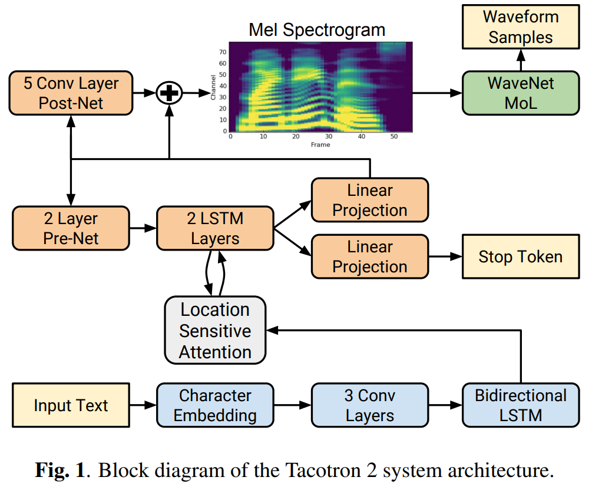
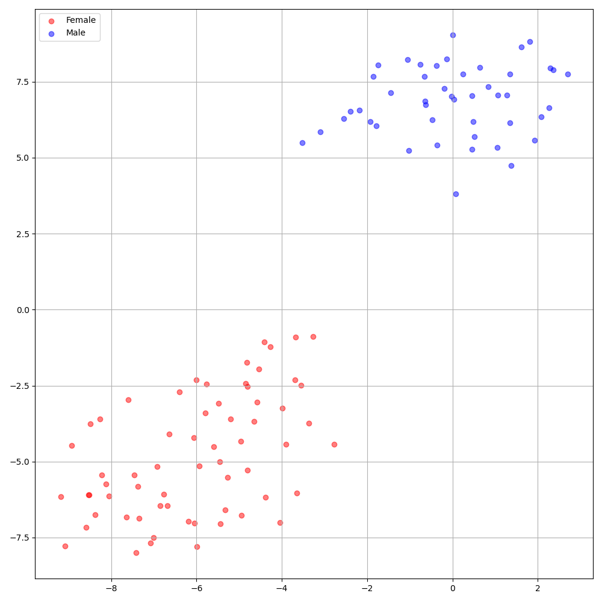

# Comprehensive Tacotron2 - PyTorch Implementation

PyTorch Implementation of Google's [Natural TTS Synthesis by Conditioning WaveNet on Mel Spectrogram Predictions](https://arxiv.org/abs/1712.05884). Unlike many previous implementations, this is kind of a **`Comprehensive Tacotron2`** where the model supports both single-, multi-speaker TTS and several techniques such as reduction factor to enforce the robustness of the decoder alignment. The model can learn alignment only in `5k`.

<p align="center">
    
</p>

The validation logs up to 70K of synthesized mel and alignment are shown below (LJSpeech_val_LJ038-0050 and VCTK_val_p323_008 from top to bottom).

<p align="center">
    
</p>
<p align="center">
    
</p>

# Quickstart

## Dependencies
You can install the Python dependencies with
```
pip3 install -r requirements.txt
```

## Inference

You have to download the [pretrained models](https://drive.google.com/drive/folders/1fGhmSVnUzdS_8i_-7cX6pfaSIQ0oiYBM?usp=sharing) and put them in `output/ckpt/LJSpeech/` or `output/ckpt/VCTK/`.

For a **single-speaker TTS**, run
```
python3 synthesize.py --text "YOUR_DESIRED_TEXT" --restore_step RESTORE_STEP --mode single --dataset LJSpeech
```

For a **multi-speaker TTS**, run
```
python3 synthesize.py --text "YOUR_DESIRED_TEXT" --speaker_id SPEAKER_ID --restore_step RESTORE_STEP --mode single --dataset VCTK
```

The generated utterances will be put in `output/result/`.


## Batch Inference
Batch inference is also supported, try

```
python3 synthesize.py --source preprocessed_data/LJSpeech/val.txt --restore_step RESTORE_STEP --mode batch --dataset LJSpeech
```
to synthesize all utterances in `preprocessed_data/LJSpeech/val.txt`. You can replace `LJSpeech` with `VCTK`. Note that only **1 batch size** is supported currently due to the autoregressive model architecture.

# Training

## Datasets

The supported datasets are

- [LJSpeech](https://keithito.com/LJ-Speech-Dataset/): a **single-speaker TTS** English dataset consists of 13100 short audio clips of a female speaker reading passages from 7 non-fiction books, approximately 24 hours in total.
- [VCTK](https://datashare.ed.ac.uk/handle/10283/3443): The CSTR VCTK Corpus includes speech data uttered by 110 English speakers (**multi-speaker TTS** ) with various accents. Each speaker reads out about 400 sentences, which were selected from a newspaper, the rainbow passage and an elicitation paragraph used for the speech accent archive.
- Any of both **single-speaker TTS** dataset (e.g., [Blizzard Challenge 2013](https://www.synsig.org/index.php/Blizzard_Challenge_2013)) and **multi-speaker TTS** dataset (e.g., [LibriTTS](https://openslr.org/60/)) can be added following LJSpeech and VCTK, respectively.

## Preprocessing

- For a **multi-speaker TTS** with external speaker embedder, download [ResCNN Softmax+Triplet pretrained model](https://drive.google.com/file/d/1F9NvdrarWZNktdX9KlRYWWHDwRkip_aP) of [philipperemy's DeepSpeaker](https://github.com/philipperemy/deep-speaker) for the speaker embedding and locate it in `./deepspeaker/pretrained_models/`.

- Run the preprocessing script
  ```
  python3 preprocess.py --dataset DATASET
  ```

## Training

Train your model with
```
python3 train.py --dataset DATASET
```

# TensorBoard

Use
```
tensorboard --logdir output/log
```

to serve TensorBoard on your localhost.
<!-- The loss curves, synthesized mel-spectrograms, and audios are shown.


 -->

# Implementation Issues

- Support `n_frames_per_step>1` mode (which is not supported by [NVIDIA's tacotron2](https://github.com/NVIDIA/tacotron2)). This is the key factor to get the robustness of the decoder alignment as described in the paper. Also, it reduces the training & inference time by the factor time.
- The current implementation provides pre-trained model of `n_frames_per_step==2`, but it should also work for any number greater than 2.
- Add [espnet's implementation](https://github.com/espnet/espnet/blob/e962a3c609ad535cd7fb9649f9f9e9e0a2a27291/espnet/nets/pytorch_backend/e2e_tts_tacotron2.py#L25) of [diagonal guided attention loss](https://arxiv.org/abs/1710.08969) to force diagonal alignment in the decoder attention module. You can toggle it by setting config.
- Two options for embedding for the **multi-speaker TTS** setting: training speaker embedder from scratch or using a pre-trained [philipperemy's DeepSpeaker](https://github.com/philipperemy/deep-speaker) model (as [STYLER](https://github.com/keonlee9420/STYLER) did). You can toggle it by setting the config (between `'none'` and `'DeepSpeaker'`).
- DeepSpeaker on VCTK dataset shows clear identification among speakers. The following figure shows the T-SNE plot of extracted speaker embedding.

<p align="center">
    
</p>

- For the vocoder, the current implementation supports **HiFi-GAN** and **MelGAN**, which are much better than **WaveNet**.
- Currently, `fp16_run` mode is not supported.

# Citation

```
@misc{lee2021comprehensive-tacotron2,
  author = {Lee, Keon},
  title = {Comprehensive-Tacotron2},
  year = {2021},
  publisher = {GitHub},
  journal = {GitHub repository},
  howpublished = {\url{https://github.com/keonlee9420/Comprehensive-Tacotron2}}
}
```

# References
- [NVIDIA's tacotron2](https://github.com/NVIDIA/tacotron2)
- [keonlee9420's tacotron2_MMI](https://github.com/keonlee9420/tacotron2_MMI)
- [keonlee9420's STYLER](https://github.com/keonlee9420/STYLER)
- [philipperemy's DeepSpeaker](https://github.com/philipperemy/deep-speaker)
- [espnet's diagonal guided attention loss](https://github.com/espnet/espnet/blob/e962a3c609ad535cd7fb9649f9f9e9e0a2a27291/espnet/nets/pytorch_backend/e2e_tts_tacotron2.py#L25)
- [Zero-Shot Multi-Speaker Text-To-Speech with State-of-the-art Neural Speaker Embeddings](https://arxiv.org/abs/1910.10838)
